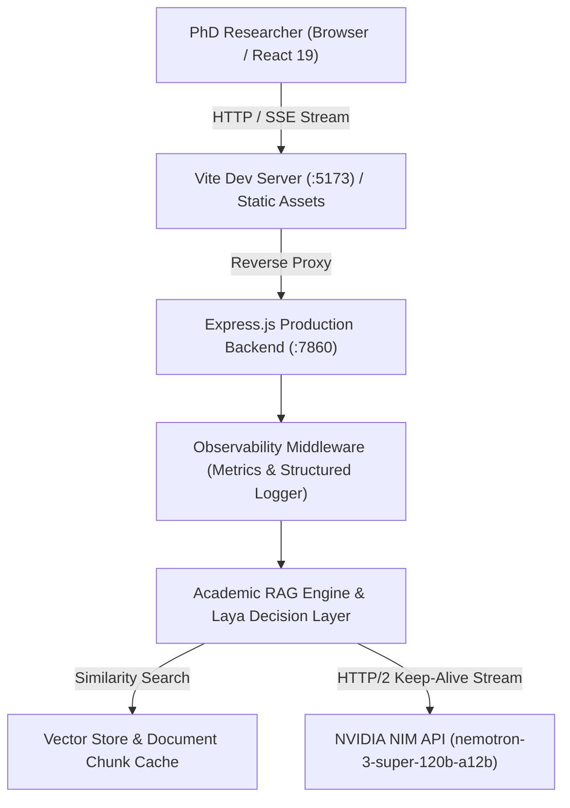

# AskiFy AI — Architecture & Systems Overview

## 1. System Overview & Target Persona

AskiFy AI is a high-performance academic research platform purpose-built for doctoral (PhD) scholars, computational researchers, and technical practitioners.

The platform provides:
* **Doctoral-Grade Depth:** Rigorous mathematical formulations, step-by-step proofs, asymptotic algorithmic complexity ($\mathcal{O}$ notation), and standard citations.
* **Text & Algorithmic Focus:** Zero distraction from image or video synthesis; purely focused on scientific discourse, mathematical derivations, code reproducibility, and document analysis.
* **Low Latency & High Reliability:** Sub-second time-to-first-token (TTFT) via Server-Sent Events (SSE) streaming, keep-alive connection pooling, query caching, and request deduplication.
* **Observability & Health:** Enterprise health checks (`/healthz`), structured JSON request tracing (`req_id`), and real-time latency percentiles (`/api/metrics`).

---

## 2. Architecture Topology



---

## 3. Core Subsystems

### 3.1. Frontend Research Workspace (`frontend/`)
* **Framework:** React 19 with Vite, Lucide Icons, and Vanilla CSS design tokens.
* **Streaming Engine (`useLLMStream.js`):** SSE reader with automated remainder buffer flushing, chunk aggregation, and abort controller safety.
* **Markdown & Code Rendering (`AssistantMessage.jsx`):** Custom `Marked` pipeline rendering syntax-highlighted code containers with language tags and clipboard copying, LaTeX formula preservation, and automatic code block closure.
* **Academic QoL Extensions:**
  * **PhD Enhance:** Automatically refines brief inquiries into doctoral-grade problem formulations.
  * **Follow-up Inquiries:** Clickable research directions surfaced below answers.
  * **Thread Persistence:** Automatic local synchronization preventing accidental loss of research threads.
  * **One-Click Export:** Instant generation of timestamped research logs in Markdown format (`.md`).

### 3.2. Backend API & Engine (`backend/`)
* **Runtime:** Node.js 18+ (Express 4).
* **Model Integration:** `nvidia/nemotron-3-super-120b-a12b` hosted via NVIDIA NIM Catalog API.
* **RAG Engine (`backend/src/ragEngine.js`):**
  * In-memory cosine similarity retrieval over chunked research documents.
  * Adaptive token budget (`MAX_TOKENS = 4096`).
  * Watchdog idle timers to ensure non-truncated, complete responses.
* **Decision Layer (`layaService.js`):** Formats student/researcher intents and learning directives.
* **Request Deduplication:** Throttles duplicate concurrent submissions within 1000ms.

### 3.3. Observability & Telemetry (`backend/src/logger.js`, `backend/src/metrics.js`)
* **Structured Logger:** Emits standard JSON logs containing ISO timestamp, unique `req_id`, method, path, status, duration (ms), and client IP.
* **Metrics Collector:** Computes rolling request counts, error rates, active streams, and latency percentiles (Average, P50, P90, P95, P99).

---

## 4. API Specification

| Endpoint | Method | Description |
|---|---|---|
| `/healthz` | GET | Standard Kubernetes/Docker health check returning HTTP 200, uptime, active model, and memory. |
| `/api/metrics` | GET | Real-time observability summary (request counts, error rate %, latency distribution). |
| `/api/health` | GET | Subsystem warmup and document index status. |
| `/api/chat` | POST | SSE streaming endpoint delivering token-by-token research responses. |
| `/api/query/enhance` | POST | Transforms colloquial questions into formal PhD-level inquiries with follow-ups. |
| `/api/documents` | GET/DELETE | Manages uploaded papers, lecture notes, and research materials. |

---

## 5. Deployment & Runbooks

### 5.1. Environment Configuration
Ensure `.env` contains:
```env
PORT=7860
NVIDIA_API_KEY=nvapi-your-key-here
```

### 5.2. Health Check Automation
Run the production healthcheck script:
```bash
./scripts/healthcheck.sh
```

### 5.3. Backup Automation
Create an archive of the active vector store and query cache:
```bash
./scripts/export_backup.sh
```
